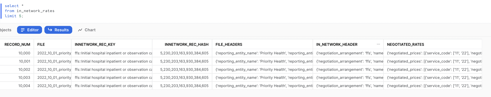
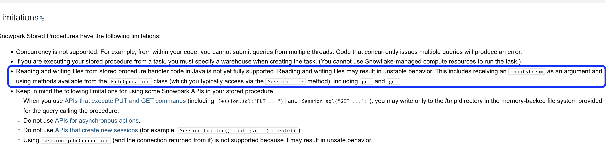

# CMSGov pricing transperancy

- [CMSgov](https://github.com/CMSgov/price-transparency-guide)

This repo is a demonstration of how to load the pricing transperancy data into Snowflake, without the
need of an external tools and processes.

## Setup and Demo execution
- [Doc: SQL-worksheet-walkthru](./doc/SQL-worksheet-walkthru.md)

Ingested sample of in_network_rates:negotiated_rates 

### Post ingestion sqls
- [Doc: Sample-post-ingestion-queries](doc/Sample-post-ingestion-queries.md)

---

## Solution
The solution involves using Python Dynamic file access feature and Snowpark stored procedures to parse
the data from the stage and ingest the same into Snowflake. The 

The Snowpark stored procedure, will not be performing a copy of the file into local sandbox environment, as
sometimes even the compresssed ones can be larger in size, greater than 500 MB. The dynamic file access feature
allow us to read the file directly from the stage.

### Why Snowpark (python) stored procedure ?
  The pricing transperancy files uncompressed can be multi GB order magnitude larger, Parsing these large 
  files using UDTF is not possible as there is a time limit of 30 seconds for the UDTF to finish execution. 
  Otherwise you will get a REQUEST_TIMEOUT exception.

  Stored procedures are however not constrained by such low time limits, they can run for multiple hours, ideally
  in a dedicated warehouse.

  We did look at adopting Java Stored Procedure, however this is a [limitation](https://docs.snowflake.com/en/sql-reference/stored-procedures-java.html#limitations) around reading and writing of files. Hence using we ruled this out.

  

  When using Stored procedure, the sandbox environment is limited to 0.5GB and some more, based on the warehouse type
  being used. In any case, these pricing transperancy files when uncompressed could potentially exceed these space limitations
  hence we need to implement a solution that should be able to process the file as a stream, idealy a compressed file stream.

  The [IJSON](https://pypi.org/project/ijson/) library is a widely adopted library in the python space, for processing 
  large json files. This library was default available in the Snowflake Anaconda channel too. The library had the 
  unique functionality to parse the json file, which are streamed and does not require to load the entire file. Thus 
  Snowpark python stored procedure was the choice for the implementation.

### Can we load the entire file into a single record ?
  The short answer NO. You also cannot create a generic solution that will ingest the data into a table.
  There are some close relations between various segments.

  More over there is a vast multiplicity on segments, makes the process complex. Without understanding these
  and blindly loading the data will result in 16MB constraint of Snowflake.

  Hence a good understanding of the data schema is a requirement. 
    - [doc: in-network-rates](https://github.com/CMSgov/price-transparency-guide/tree/master/schemas/in-network-rates)

  For the in-network-rates implementation, we split and store on the following fields
    - negotiated_rates
    - bundled_codes
    - covered_services

## Sample files

  As per CMS all the major health care providers have to share the data. We found the following websites where the
  data is present:

  - [Priority Health](https://www.priorityhealth.com/landing/transparency)
  - *TO ADD MORE WEBSITES *

---
## Concerns and Limitations

### Snowflake Features

  - *Python Dynamic file access:* is currently in PrPr.
  
### Speeding up ingestion

  This demonstration showcases how to parse the large file; the data ingestion is slow on the current implementation. However there are possiblities to parallelize and improve the speed of ingestion. These improvements are left to adopters of this demo.