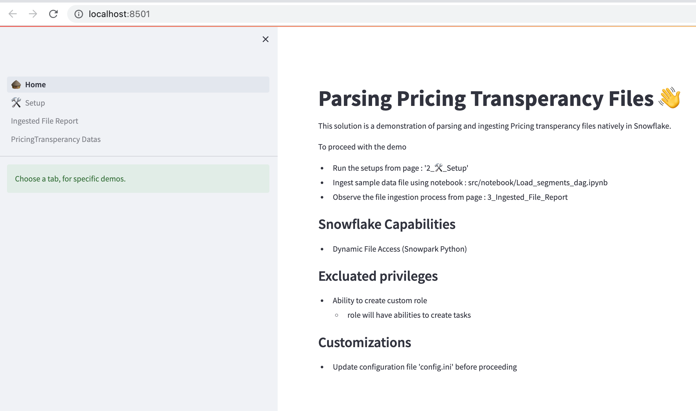
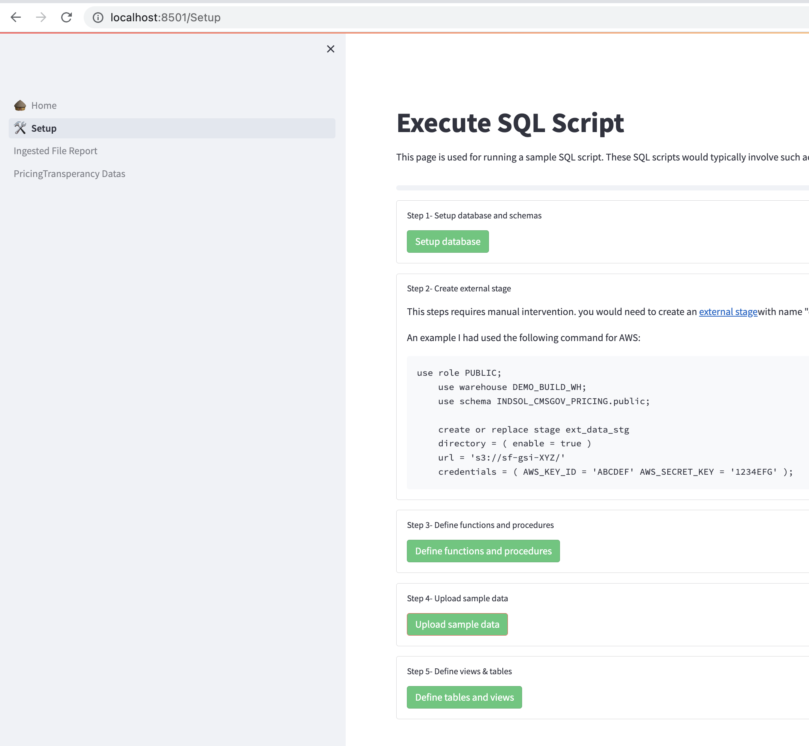

## Links
- [Links](#links)
  - [Note on production readiness](#note-on-production-readiness)
  - [ How to setup and run the demo (Locally)](#-how-to-setup-and-run-the-demo-locally)
    - [Installation tools:](#installation-tools)
    - [Setup project:](#setup-project)
    - [Setting up resources](#setting-up-resources)
      - [Pre-Requisite](#pre-requisite)
      - [Steps](#steps)
  - [Ingestion Flows](#ingestion-flows)


### Note on production readiness
This demo is not meant for production, as there are some steps which needs to hardened for a real-production ready worth. Also every organization have thier own policies of defining real-production ready worth.

Since the main aspect of the solution is how to solve the probelem of parsing a large sized data file. It does not mean that we have followed all the necessary best-practices in the demo w.r.t Custom roles, security, data zones etc.. These will need to be tuned to your environment needs.

### <a name="demo_setup"></a> How to setup and run the demo (Locally)
In case if you do not have access to GitHub codespace environment, follow these steps to run the demo.

**NOTE:** It is assumed that you have following skils:
    - Hands on python, SQL, Snowflake developer
    - You know howto install and connect to Snowflake 
    - You are using or have used Visual Studio Code

#### Installation tools:
Install the following :

- [Anaconda](https://www.anaconda.com/)
- [SnowSQL](https://docs.snowflake.com/en/user-guide/snowsql-install-config.html) 
- [Visual Code](https://code.visualstudio.com/)

#### Setup project:
- Download this project
- Import the project into Visual Code
- Open terminal view (inside visual code) and goto project home dir.
- Run the following command to create a conda env named 'pysnowpark' and also the set of base libraries like jupyter, snowpark, streamlit etc..
```sh
    conda env update --file .devcontainer/conda_pyspark_environment.yml
```

If you already have a env named 'pysnowpark' use this command:

```sh
    conda env update -n pysnowpark --file .devcontainer/conda_pyspark_environment.yml
```

- Create a local secrets file: sflk_connection.json based of the template file: [snowflake_connection.json.template](../snowflake_connection.template.json)
- Update configurations and app configurations specific to your solution under `APP_DB` section of [config.ini](../config.ini)
- validate if stuffs are running:
  - run streamlit app: ./bin/run_app.sh
  - run snowsql: ./bin/connect_snowsql.sh

#### Setting up resources

##### Pre-Requisite
In order to setup and execute in your Snowflake, the following are the pre-requsites for this demo:
  - You have access to Accountadmin role
  - The 'Dynamic File Access' feature is enabled
  - You should be able to define an external stage in your cloud provider
  - Snowflake connection file is setup
  - Config.ini is updated (optionally)

##### Steps
 - Open terminal view in vscode
 - Switch to conda pysnowpark env: `conda activate pysnowpark`
 - Run streamlit app: `./bin/run_app.sh`
    This normally opens your default browser and opens the url: `http://localhost:8501/`



 - Go to Setup page and run the various steps in the order. These steps will:
   - Create a database ,schemas ,stages
   - Create a custom role with task privileges and grant access to this to the 'public' role.
   - Load sample datasets
   - Define tables, views & functions and procedures
 
 
 - asd


### <a name="ingestion_flows"></a>Ingestion Flows

The current solution has various artifacts which aids in the loading and processing of the files. This sections walks thru these steps:


- Step-1: Upload the data file into a internal/external stage. 
  
- Step-2: Invoke the stored procedure 'in_network_rates_dagbuilder'. This would create a DAG with interconnected tasks  that will perform the process. This DAG is specific to thie data file.  The tasks will have the filename as part of its name. There are specific parameters which will aid in parallelization and processing. 
  
- Step-3: The DAG would have created a root task, for ex: 'DAG_ROOT_REDUCED_SAMPLE' . Invoke this root task, which will execute all the various  sub tasks.
  
- Step-4: Once all the DAG tasks are finished, refresh the defined external stage and external table . This will allow for further processing. Depending on the size of the file, this refresh could take some time.