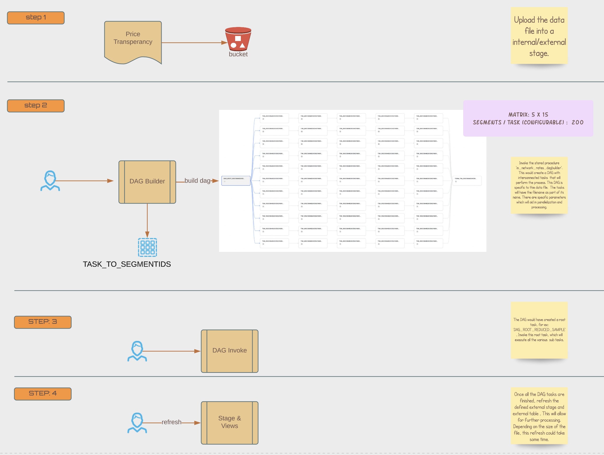

# Ingestion Flows

The current solution has various artifacts which aids in the loading and processing of the files. This sections walks thru these steps:

- Step-1: Upload the data file into a internal/external stage. 
  
- Step-2: Invoke the stored procedure 'in_network_rates_dagbuilder'. This would create a DAG with interconnected tasks  that will perform the process. This DAG is specific to thie data file.  The tasks will have the filename as part of its name. There are specific parameters which will aid in parallelization and processing. 
  
- Step-3: The DAG would have created a root task, for ex: 'DAG_ROOT_REDUCED_SAMPLE' . Invoke this root task, which will execute all the various  sub tasks.
  
- Step-4: Once all the DAG tasks are finished, refresh the defined external stage and external table . This will allow for further processing. Depending on the size of the file, this refresh could take some time.