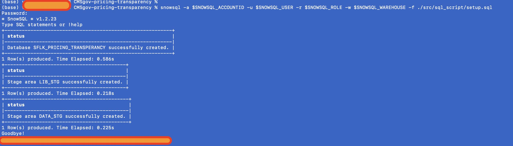
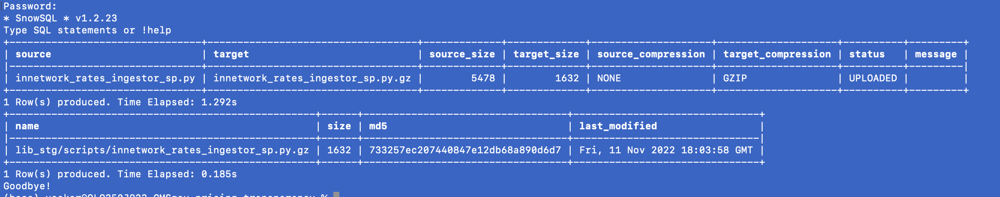
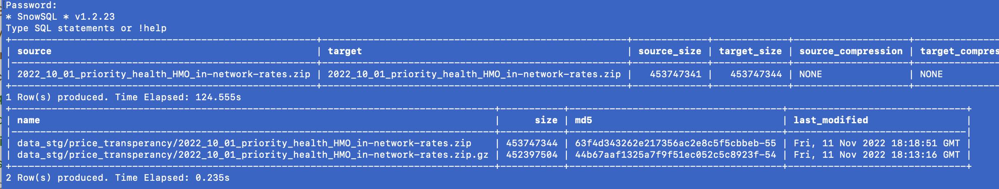
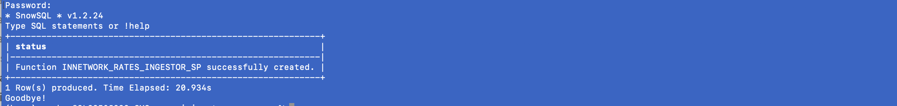

# Execution using SQL 

In this doc, we will go through the following steps involved with the demonstrating the capabilities
- configuring the base resources (stages, procedures)
- upload sample data to stage
- parsing the in-network-rates files using Stored procedure.

The demonstration assumes the following:
- Snowflake account
- Snowpark (Python) dynamic file access is enabled
- [Snowsql client](https://docs.snowflake.com/en/user-guide/snowsql.html) has been installed and configured
  
## Setup 

We will be creating some basic resources like database, stages in this section. It is assumed that 
- you are using an existing role that has ability to create a database. 
- your role has a warehouse

### Login to SnowCLI

1. Create database & stages:
   
    ```sh
        snowsql -a $SNOWSQL_ACCOUNT -u $SNOWSQL_USER -r $SNOWSQL_ROLE -w $SNOWSQL_WAREHOUSE -f ./src/sql_script/setup.sql
    ```
    

2. Upload parsing stored procedure scripts
   
   The logic for parsing the JSON file is large and better organized as the python logic in a proper py script file. The stored
   procedure that will not be declared as inline.
   ```sh
        snowsql -a $SNOWSQL_ACCOUNT -u $SNOWSQL_USER -r $SNOWSQL_ROLE -w $SNOWSQL_WAREHOUSE -f ./src/sql_script/lib_stage_upload.sql
    ```
    

3. Upload sample data (optional)

    Our recommendation in general is to have the pricing-transperancy file (ex: in-network-rates) be hosted in an external stage.
    However to ease for a quick demo, we have supplied some sample data that we sourced from [Priority Health](https://www.priorityhealth.com/landing/transparency).

    In this step, we will uploading the data to an internal stage (data_stg). 
    <span style="color:blue">*WARNING!!* The data file (2022_10_01_priority_health_HMO_in-network-rates.zip) is almost 500MB, hence upload
        to the stage will depend on your bandwidth.</span>
    
    ```sh
        snowsql -a $SNOWSQL_ACCOUNT -u $SNOWSQL_USER -r $SNOWSQL_ROLE -w $SNOWSQL_WAREHOUSE -f ./src/sql_script/data_stage_upload.sql
    ```
    

4. Create the store procedures

    We will be define the stored procedure which will be used for the parsing and ingesting the data.
    ```sh
        snowsql -a $SNOWSQL_ACCOUNT -u $SNOWSQL_USER -r $SNOWSQL_ROLE -w $SNOWSQL_WAREHOUSE -f ./src/sql_script/define_stored_procedures.sql
    ```
    

## Execution
Now we proceed with the parsing execution. This will take a very long time as the data file can be of large size.

In our demo, the compressed 450MB turned out to *13.5GB* ,uncompressed. It took around 2 hours to load around 37 million records

```sql
    -- Recommendation to have the size to something
    -- larger than XSMALL. Choose XLARGE arbirtarily
    alter warehouse dev_pctransperancy_demo_wh 
        set warehouse_size = 'XLARGE';
    
    -- Set an arbiratrary of 1000 batch size
    call sflk_pricing_transperancy.public.innetwork_rates_ingestor_sp(
        10000
        ,'data_stg/price_transperancy' 
        ,'2022_10_01_priority_health_HMO_in-network-rates.zip'); 
```

When the ingestion is done, you would the data getting populated in the following tables:

- sflk_pricing_transperancy.public.in_network_rates
- sflk_pricing_transperancy.public.bundled_codes


