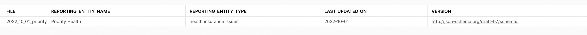
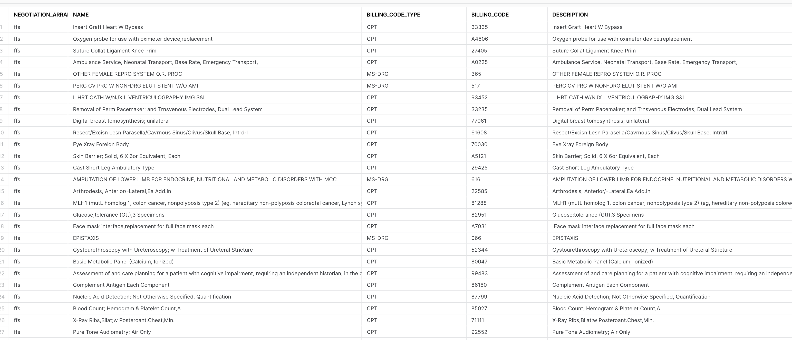

## Post ingestion queries (Sample)

Here are some sample queries that can be issued on top of
the ingested data. 

### File Headers

```sql
with base as (
    select 
        file
        ,parse_json(file_headers) as fh
        ,count(*) as dummy
    from in_network_rates
    group by file ,fh
)
select
    file 
    ,fh:reporting_entity_name::varchar as reporting_entity_name
    ,fh:reporting_entity_type::varchar as reporting_entity_type
    ,fh:last_updated_on::varchar as last_updated_on
    ,fh:version::varchar as version
from base
;
```



### In Network - Negotiation arrangements

```sql
with base as (
    select 
        parse_json(in_network_header) as nh
        ,count(*) as dummy
    from in_network_rates
    group by nh
)
select
    nh:negotiation_arrangement::varchar as negotiation_arrangement
    ,nh:name::varchar as name
    ,nh:billing_code_type::varchar as billing_code_type
    ,nh:billing_code_type_version::varchar as billing_code_type_version
    ,nh:billing_code::varchar as billing_code
    ,nh:description::varchar as description
from base
;
```

