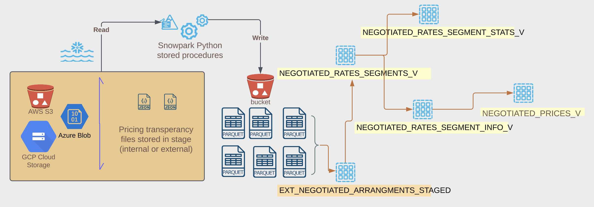
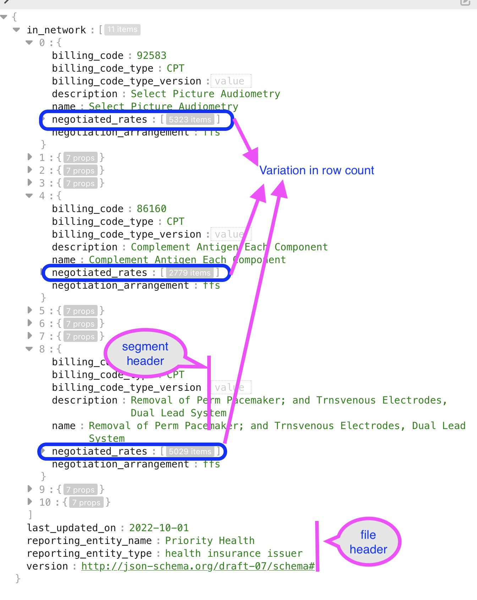
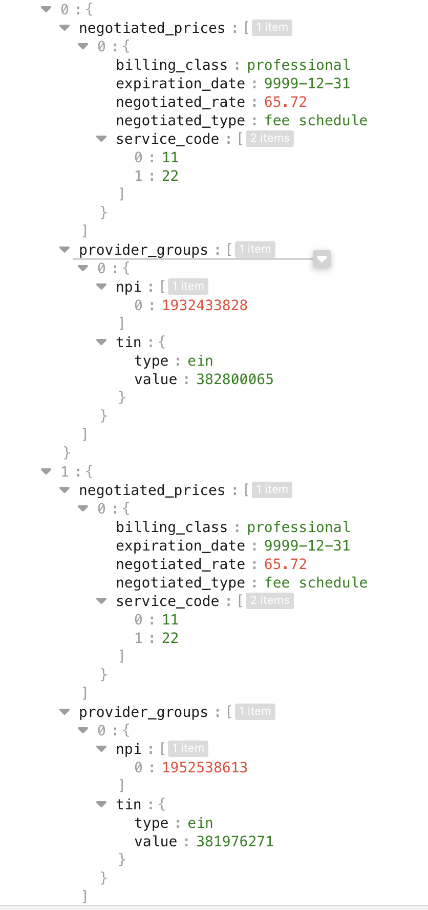
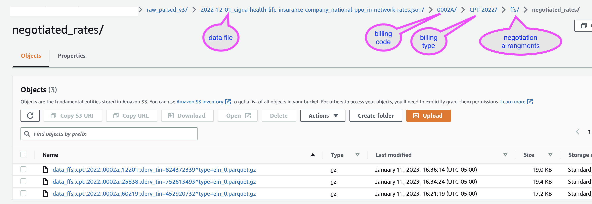
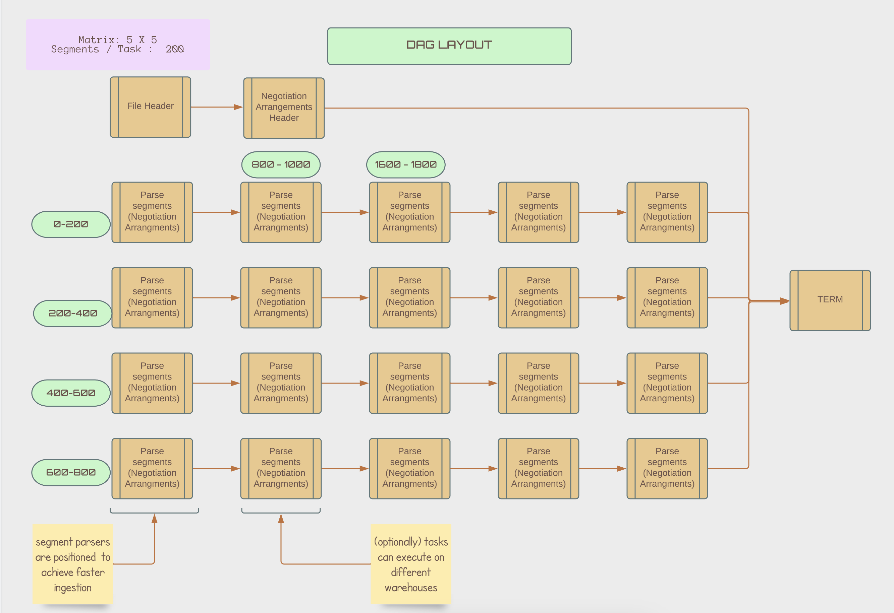
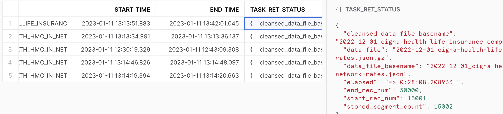
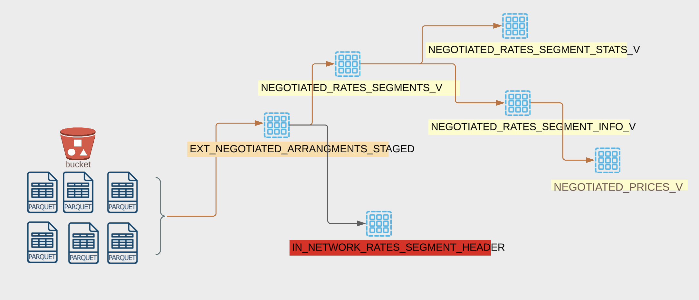

# Solution

### TLDR; version
- The pricing files are stored in a stage
- We build a DAG with tasks. These tasks are implemented using Snowpark(python) stored procedures. 
  Using 'Dynamic File Access' and the [IJSON](https://pypi.org/project/ijson/) library, the procedures will be parsing the file for specific ranges of segments (passed via parameters). The files are stored as parquet files in an external stage. The files are stored in a partitioned folders.
- An external table will be defined to read these parquet files.

Further processing of the data is left to user of data.

### Solution Walthru



#### Factors for spliting the files

##### Can we load the entire file into a single record ?

The short answer NO. You also cannot create a generic solution that will ingest the data into a table.
There are some close relations between various segments.

More over there is a vast multiplicity on segments, makes the process complex. Without understanding these
and blindly loading the data will result in 16MB constraint of Snowflake.

Hence a good understanding of the data schema is a requirement. 
  - [doc: in-network-rates](https://github.com/CMSgov/price-transparency-guide/tree/master/schemas/in-network-rates)

For the in-network-rates implementation, we split and store on the following fields
  - negotiated_rates
  - bundled_codes
  - covered_services
  
Based on my investigation on the file; I realized that the negotiated rates has multiple records and varies based on various
billing code. Hence this element in the section would be a good factor to break the structure into multiple records.


The negotiated prices child elements are infact smaller and can easily be stored inside the variant column and would not
break the 16MB barrier. 


This structure can be stored in the original JSON structure format. 

Also based on experimentations I found that if the number of children "negotiated prices" is greater than 5k, then its easy
to cross the 16MB barrier. In such conditions we can artifically break into chunks and serve it to users.

##### Why Snowpark (python) stored procedure ?

The pricing transperancy files uncompressed can be multi GB order magnitude larger, Parsing these large 
files using UDTF is not possible as there is a time limit of 30 seconds for the UDTF to finish execution. 
Otherwise you will get a REQUEST_TIMEOUT exception.

Stored procedures are however not constrained by such low time limits, they can run for multiple hours, ideally
in a dedicated warehouse.

We did look at adopting Java Stored Procedure, however this is a [limitation](https://docs.snowflake.com/en/sql-reference/stored-procedures-java.html#limitations) around reading and writing of files from stage, currently. Hence using we ruled this out.


When using Stored procedure, the sandbox environment is limited to 0.5GB and some more, based on the warehouse type
being used. In any case, these pricing transperancy files when uncompressed could potentially exceed these space limitations
hence we need to implement a solution that should be able to process the file as a stream, idealy a compressed file stream.

The [IJSON](https://pypi.org/project/ijson/) library is a widely adopted library in the python space, for processing 
large json files. This library was default available in the Snowflake Anaconda channel too. The library had the 
unique functionality to parse the json file, which are streamed and does not require to load the entire file. Thus 
Snowpark python stored procedure was the choice for the implementation.

##### Staging parquet files

Based on experimentations, I found that when storing a dataframe from stored proc there is inherently a temporary stage creation, uploading of the data into this stage finally performing a copy into operation. While these set of operations are ok for smaller
data processing, however when we are processing multi GB file sized data it introduced a lot of time. 

Moreover, based on my interaction with some SME's I realized that it is not always of best interest that the user is interested in all the billing code segments. While some use are very focused and others are broader.

Hence the segments once parsed are staged in the external stage as parquet files. An external table 'ext_negotiated_arrangments_staged' can be used to process the records. The files will be stored in a partition manner. The partition would be of:
```
 <data file>/<billing code>/<billing code type & version>/<negotiation arrangement>/<segment type>/(parquet data file)
```


#### Tasks & DAGS

When it comes to parsing and processing data file, doing in a single instance of Stored procedure results in a long duration. Parallelizing the processing can help in speed of ingestion. In order to achieve this, we define tasks based of a stored procedure [negotiation_arrangements.py](../src/python/negotiation_arrangements.py) which is parameterized to parse only certain portions / segments of the file and ignore any other sections. We could interconnect and arrange these tasks into a DAG and thus achieve parallel processing. Once ingestion is completed, these tasks will be suspended. Finally the entire DAG can be deleted also. These tasks will be specific to a data file that is getting processed.



The above is a layout of such a DAG, with different tasks. The tasks are arranged in a way such that consequtive segments are processed in parallels. Also the tasks can optionally run in different warehouse thus achieving parallel execution.

Lastly one cool thing I did is that; this DAG is completely defined dynamic. With just a call to stored procedure [in_network_rates_dagbuilder.py](./src/python/in_network_rates_dagbuilder.py), this DAG gets created in Snowflake. And just by invoking the root task the entire set of tasks starts processing. 

All the status of the executions will be stored in the table: SEGMENT_TASK_EXECUTION_STATUS


#### Views, further processings

As mentioned earlier, the data can be queried via the external table 'ext_negotiated_arrangments_staged'. When storing the various segments we stored the child elements in JSON/variant columns. The users can now build different types of views as they see fit. I have created the following views as part of this demo:



### Limitations & Next steps

- Based on the file size, SLAs will need to vary. For example CIGNA 1TB sized file takes a longer time to ingest vs Priority Health data 10GB sized files takes around 30 min.
- Based on your needs, further data pipelines would need to be build out and not provided in this demo.
- Refreshing of external stagest/views will take some time. Hence would be better to ingest these into a native table as post processing pipelines.

