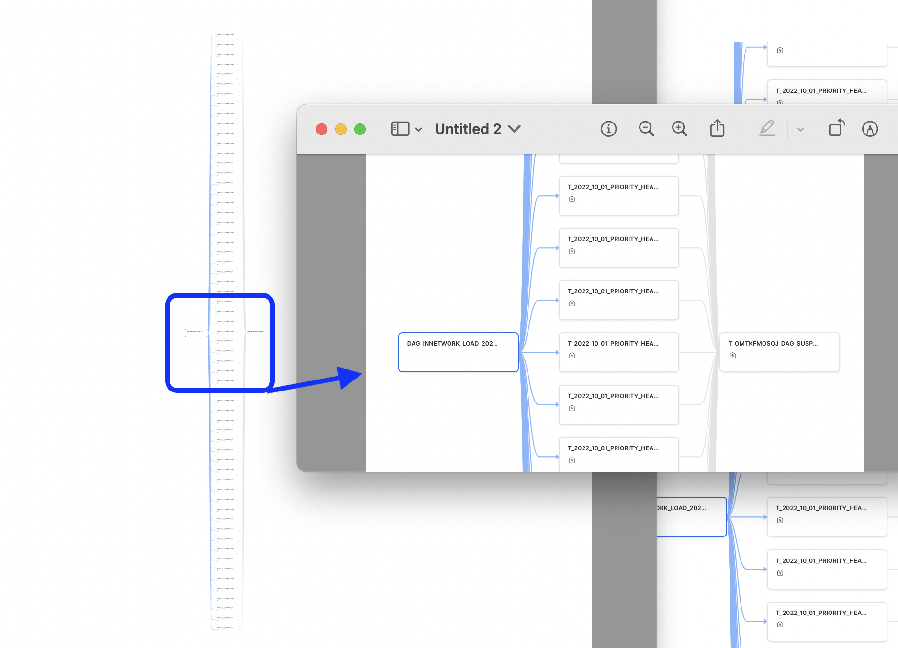

## Solution

The pricing files are stored in a stage, We use Snowpark(python) stored procedures

The solution involves using Python Dynamic file access feature and Snowpark stored procedures to parse
the data from the stage and ingest the same into Snowflake. The 

The Snowpark stored procedure, will not be performing a copy of the file into local sandbox environment, as
sometimes even the compresssed ones can be larger in size, greater than 500 MB. The dynamic file access feature
allow us to read the file directly from the stage.

### Why Snowpark (python) stored procedure ?
  The pricing transperancy files uncompressed can be multi GB order magnitude larger, Parsing these large 
  files using UDTF is not possible as there is a time limit of 30 seconds for the UDTF to finish execution. 
  Otherwise you will get a REQUEST_TIMEOUT exception.

  Stored procedures are however not constrained by such low time limits, they can run for multiple hours, ideally
  in a dedicated warehouse.

  We did look at adopting Java Stored Procedure, however this is a [limitation](https://docs.snowflake.com/en/sql-reference/stored-procedures-java.html#limitations) around reading and writing of files. Hence using we ruled this out.

  

  When using Stored procedure, the sandbox environment is limited to 0.5GB and some more, based on the warehouse type
  being used. In any case, these pricing transperancy files when uncompressed could potentially exceed these space limitations
  hence we need to implement a solution that should be able to process the file as a stream, idealy a compressed file stream.

  The [IJSON](https://pypi.org/project/ijson/) library is a widely adopted library in the python space, for processing 
  large json files. This library was default available in the Snowflake Anaconda channel too. The library had the 
  unique functionality to parse the json file, which are streamed and does not require to load the entire file. Thus 
  Snowpark python stored procedure was the choice for the implementation.

### Can we load the entire file into a single record ?
The short answer NO. You also cannot create a generic solution that will ingest the data into a table.
There are some close relations between various segments.

More over there is a vast multiplicity on segments, makes the process complex. Without understanding these
and blindly loading the data will result in 16MB constraint of Snowflake.

Hence a good understanding of the data schema is a requirement. 
  - [doc: in-network-rates](https://github.com/CMSgov/price-transparency-guide/tree/master/schemas/in-network-rates)

For the in-network-rates implementation, we split and store on the following fields
  - negotiated_rates
  - bundled_codes
  - covered_services

### Ingestion / Processing time

#### Single stored proc
We initially started of with an implementation, [innetwork_rates_ingestor_sp](../src/python/innetwork_rates_ingestor_sp.py), which was loading each segments (negotiation_arrangments records) in a sequential manner.

It took us nearly 8+ hours to load the complete file entirely. Though we were good to observe that there was no process breakage for even that long of duration. We were not satisfied on the speed.

#### Split Parallelize Dag
We realized that there is no need of dependency between each segments (negotiation_arrangments records). Hence we could parallelize this ingestion where 
 - We create bucket/chunks/partitions of segments. For ex 7000 negotiation_arrangments are split and arranged into 50 buckets. 
 - Then a stored procedure was created to process each of these chunks in isolation
 - Using DAG, we could now build a pipeline (dynamically), that would create 50 tasks. These tasks would run in parallel

For this to work,
  - we set the size of the warehouse to XLARGE
  - We also set concurrency to 10 max warehouses

Here are some observations
 - 50 Buckets took 2 hours
 - 61 Buckets took 1 hour
 - 90 Buckets took 50 minutes

Task has a limitation of only 100 children/parent; hence we did not want to reach the max levels. 

Also, if the DAG/Scheduling is orchestreted/managed externally, ex: airflow etc, i beleive we could reduce the time even further.

We also create a "suspender" task, at the end of DAG. This essentially runs after all the tasks are executed. Its main purpose
is to cleanup the entire dag tree. 

